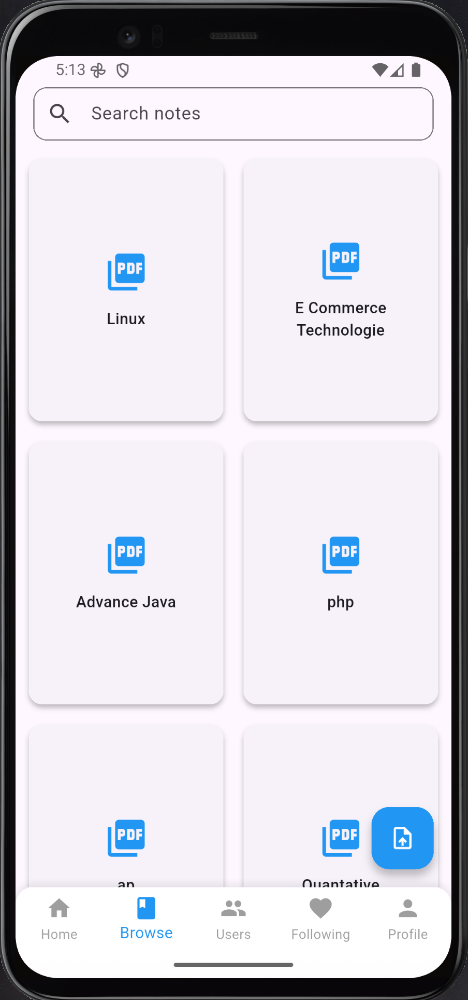
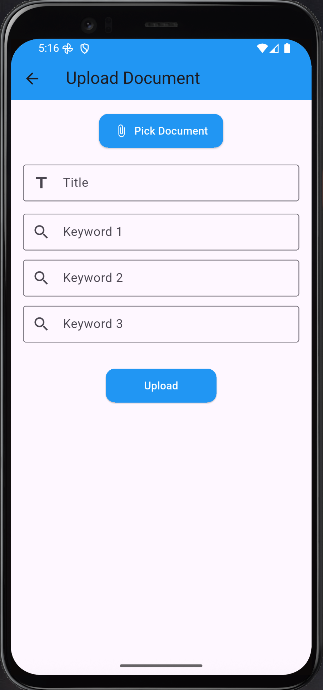
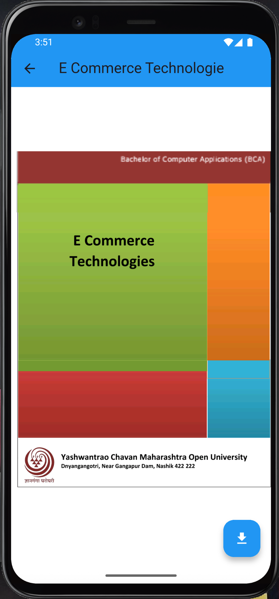

# 📝 Note Sharing App (Flutter)

<!-- PROJECT BADGES -->

[](https://flutter.dev)  
[](https://dart.dev)  
[](https://github.com/yourusername/note_sharing_app_flutter/actions)  
[](LICENSE)

> A mobile-first Flutter application for seamless uploading, browsing, and sharing of study notes.

---

## 🎯 Table of Contents

1. [About](#about)
2. [Features](#features)
3. [Screenshots](#screenshots)
4. [Tech Stack](#tech-stack)
5. [Getting Started](#getting-started)
   - [Prerequisites](#prerequisites)
   - [Install & Run](#install--run)
   - [Release Build](#release-build)
6. [State Management](#state-management)
7. [Folder Structure](#folder-structure)
8. [Testing](#testing)
9. [Contributing](#contributing)

---

## 🧐 About

This Flutter frontend powers the Note Sharing App—a platform to upload and discover lecture notes, problem sets, and more. Designed for Android (iOS support planned), it emphasizes smooth infinite scrolling, powerful search, and social features (follow/unfollow).

---

## ✨ Features

- 📤 **Upload** PDFs & images with title & keywords
- 🔎 **Search** by title or keywords (infinite scroll)
- 👥 **Social**: follow peers & view a personalized feed
- 🔄 **Profile**: update college, university, course anytime
- ⚡ **Performance**: <2 s load on mid-tier Android devices
- 📱 **Responsive UI** built entirely with Flutter widgets

---

## 📸 Screenshots

<p align="center">
  
  
  
</p>

---

## 🛠 Tech Stack

| Layer        | Technology           |
| ------------ | -------------------- |
| UI           | Flutter & Dart       |
| State Mgmt   | provider             |
| Networking   | dio                  |
| File Picker  | file_picker          |
| External Int | url_launcher, intent |

---

## 🚀 Getting Started

### Prerequisites

- Flutter 3.7.x & Dart 2.19
- Android SDK & emulator or physical device

### Install & Run

```bash
# 1. Clone frontend repo
git clone https://github.com/yourusername/note_sharing_app_flutter.git
cd note_sharing_app_flutter

# 2. Install dependencies
flutter pub get

# 3. Run on emulator or device
flutter run
Release Build
# Build APK for release
flutter build apk --release

# Build iOS app (on macOS)
flutter build ios --release

```

## 🧠 State Management

This project uses the `provider` package for state management:

- `AuthProvider` handles user authentication state.
- `NoteProvider` manages note list, pagination, and search.
- `UserProvider` manages user profiles and social follow state.

All providers extend `ChangeNotifier` and are injected via `MultiProvider` in `main.dart`.

---

## 🗂 Folder Structure

```plaintext
lib/
├── main.dart          # App entrypoint & MultiProvider setup
├── services/          # API service classes (AuthService, NoteService)
├── providers/         # ChangeNotifier classes
├── screens/           # UI screens (Login, Register, Browse, Upload, Profile)
├── widgets/           # Reusable widgets (NoteCard, CustomAppBar)
└── utils/             # Constants, themes, helpers
assets/
├── images/            # Static assets (icons, logos)
└── configs/           # Config files (env.dart)
```

## ✅ Testing

Unit Tests
Services & utility functions using flutter_test and mockito:
``` bash
flutter test test/unit
``` 
Integration Tests
End-to-end flows (login → upload → browse) using integration_test:
``` bash
flutter test integration_test
``` 

## 🤝 Contributing

Fork this repository
Clone your fork:
``` bash
git clone https://github.com/yourusername/note_sharing_app_flutter.git
``` 
Create a feature branch:
``` bash
git checkout -b feature/your-feature-name
``` 
Commit your changes:
``` bash
git commit -m "feat: add new feature"
``` 
Push to your fork:
``` bash
git push origin feature/your-feature-name
``` 
