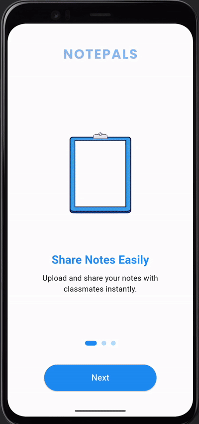

# 📝 Note Sharing App (Flutter)

<!-- PROJECT BADGES -->

[](https://flutter.dev)  [](https://dart.dev)  [](https://www.linkedin.com/in/swastikshetty06/)  [](https://github.com/SwastikShetty06/Collage-Project-Backend)

> A mobile-first Flutter application for seamless uploading, browsing, and sharing of study notes.

---

## 🎯 Table of Contents

1. [About](#about)
2. [Features](#features)
3. [Screenshots](#screenshots)
4. [Backend Integration](#backend-integration)
5. [Tech Stack](#tech-stack)
6. [Getting Started](#getting-started)
   - [Prerequisites](#prerequisites)
   - [Install & Run](#install--run)
   - [Release Build](#release-build)
7. [State Management](#state-management)
8. [Folder Structure](#folder-structure)
9. [Testing](#testing)

---

## 🧐 About

This Flutter frontend powers the Note Sharing App—a platform to upload and discover lecture notes, problem sets, and more. Designed for Android (iOS support planned), it emphasizes smooth infinite scrolling, powerful search, and social features (follow/unfollow).

---

## ✨ Features

- 📤 **Upload** PDFs & images with title & keywords  
- 🔎 **Search** by title or keywords (infinite scroll)  
- 👥 **Social**: follow peers & view a personalized feed  
- 🔄 **Profile**: update college, university, course anytime  
- ⚡ **Performance**: <2 s load on mid-tier Android devices  
- 📱 **Responsive UI** built entirely with Flutter widgets  

---

## 📸 App demo

<p align="center">
  
</p>

---

## 🧩 Backend Integration

This Flutter frontend is powered by a Spring Boot backend that manages user authentication, note storage, and real-time interactions.

🔗 **Backend Repository:** [Collage-Project-Backend (Spring Boot)](https://github.com/SwastikShetty06/Collage-Project-Backend)

### Backend Features:
- ✅ JWT-based authentication & authorization  
- 📁 Upload & manage notes (PDFs/images)  
- 🔎 Search functionality with keyword indexing  
- 👥 User profiles & follow system  
- 📊 REST APIs for frontend consumption  

> ⚠️ Make sure the backend is running and API base URL is correctly configured in your frontend (e.g., in `env.dart` or constants).

---

## 🛠 Tech Stack

| Layer        | Technology           |
| ------------ | -------------------- |
| UI           | Flutter & Dart       |
| State Mgmt   | provider             |
| Networking   | dio                  |
| File Picker  | file_picker          |
| External Int | url_launcher, intent |

---

## 🚀 Getting Started

### Prerequisites

- Flutter 3.7.x & Dart 2.19  
- Android SDK & emulator or physical device  
- Spring Boot backend server (see [Backend Integration](#backend-integration))

### Install & Run

```bash
# 1. Clone frontend repo
git clone https://github.com/yourusername/note_sharing_app_flutter.git
cd note_sharing_app_flutter

# 2. Install dependencies
flutter pub get

# 3. Run on emulator or device
flutter run
```

### Code Contributors

<a href="https://github.com/SwastikShetty06/Collage-Project-Frontend/graphs/contributors">
  
</a>

<!-- Manually added contributor -->
<a href="https://github.com/sanvishetty48">
  
  <br />
  <sub><b>sanvishetty48</b></sub>
</a>

<p align="right">(<a href="#readme-top">back to top</a>)</p>

